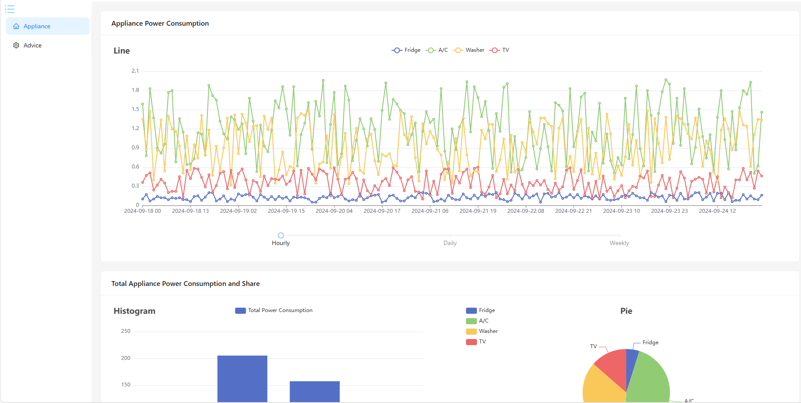
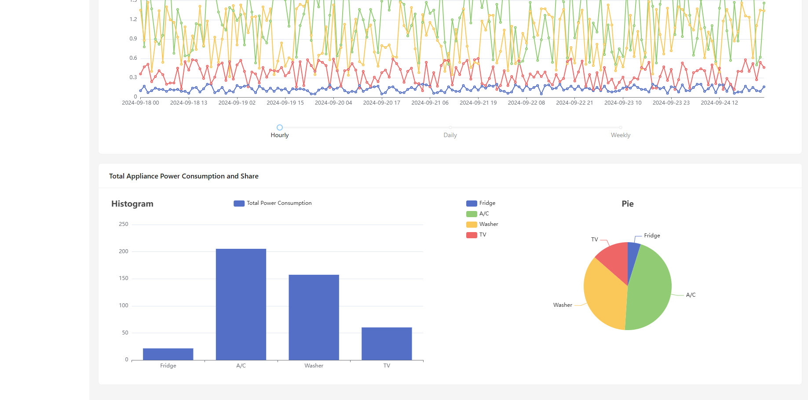
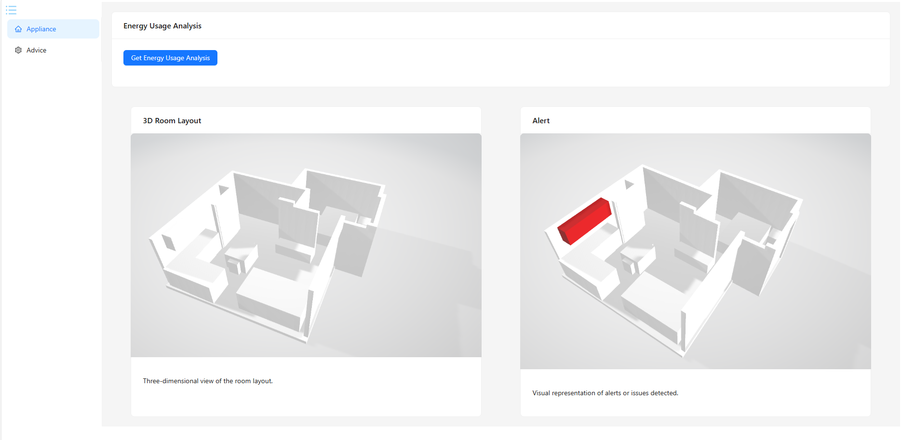
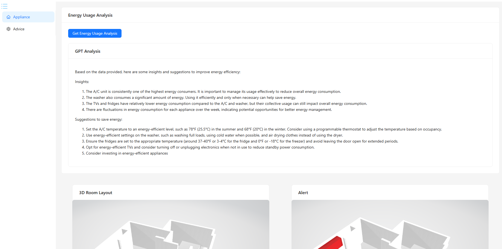

# Hackathan-WiseWatt

It is a demo for 2024 Unimelb Hackathon-Problem 4 for GPT 5.0.

## Backend

1. Use `fake.py` to generate a user called `user1` appliance usage in a week. 

   It was done, and database is `appliance.db`

2. Flask frame

   First, change `openai_key`

   ```python
   openai.api_key = 'Your openai_key'
   ```

   Run `app.py` in `localhost:5000` and response to the front
   
   

## Front

React frame

```shell
npm install
npm run start
```

The front page run in `localhost:3000` and visit the `localhost:3000/home` to view


## 3D Room Resturction

We just use the apple developer RoomPlan in WWDC. It can be exported as `.USDZ` and can be converted to `.glb`.

[RoomPlan Overview - Augmented Reality - Apple Developer](https://developer.apple.com/augmented-reality/roomplan/)

Once we have obtained the model of the house and each component inside using the Apple Developer RoomPlan, we can associate each device model with a smart meter. For devices that are abnormal, we can mark them with a red warning.


## Demostration








